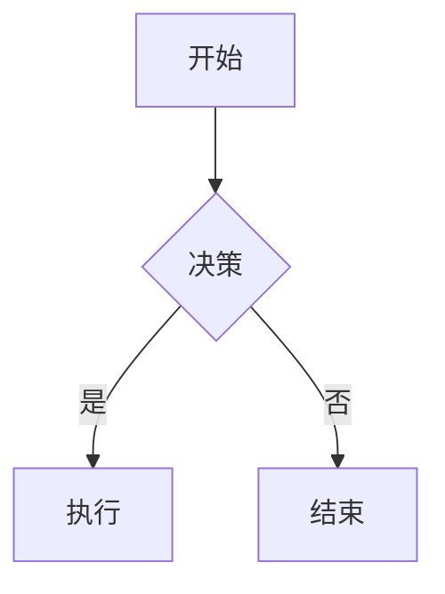

> 来源：[mrgoonie/claudekit-skills](https://github.com/mrgoonie/claudekit-skills) | 分类：F-设计与内容

# Mermaid.js v11

## 概述

使用 Mermaid.js v11 声明式语法创建基于文本的图表。通过 CLI 将代码转换为 SVG/PNG/PDF，或在浏览器/Markdown 文件中渲染。

## 快速开始

**基本图表结构：**
```
{diagram-type}
  {diagram-content}
```

**常见图表类型：**
- `flowchart` - 流程图、决策树
- `sequenceDiagram` - 角色交互、API 流程
- `classDiagram` - 面向对象结构、数据模型
- `stateDiagram` - 状态机、工作流
- `erDiagram` - 数据库关系
- `gantt` - 项目时间线
- `journey` - 用户体验流程

参见 `references/diagram-types.md` 了解全部 24+ 类型的语法。

## 创建图表

**内联 Markdown 代码块：**
````markdown

````

**通过前置元数据配置：**
````markdown

````

**注释：** 使用 `%% ` 前缀添加单行注释。

## CLI 用法

将 `.mmd` 文件转换为图像：
```bash
# 安装
npm install -g @mermaid-js/mermaid-cli

# 基本转换
mmdc -i diagram.mmd -o diagram.svg

# 带主题和背景
mmdc -i input.mmd -o output.png -t dark -b transparent

# 自定义样式
mmdc -i diagram.mmd --cssFile style.css -o output.svg
```

参见 `references/cli-usage.md` 了解 Docker、批量处理和高级工作流。

## JavaScript 集成

**HTML 嵌入：**
```html
<pre class="mermaid">
  flowchart TD
    A[客户端] --> B[服务器]
</pre>
<script src="https://cdn.jsdelivr.net/npm/mermaid@latest/dist/mermaid.min.js"></script>
<script>mermaid.initialize({ startOnLoad: true });</script>
```

参见 `references/integration.md` 了解 Node.js API 和高级集成模式。

## 配置与主题

**常用选项：**
- `theme`："default"、"dark"、"forest"、"neutral"、"base"
- `look`："classic"、"handDrawn"
- `fontFamily`：自定义字体规格
- `securityLevel`："strict"、"loose"、"antiscript"

参见 `references/configuration.md` 了解完整配置选项、主题和自定义。

## 实用模式

加载 `references/examples.md` 获取：
- 架构图
- API 文档流程
- 数据库架构
- 项目时间线
- 状态机
- 用户旅程图

## 资源

- `references/diagram-types.md` - 全部 24+ 图表类型的语法
- `references/configuration.md` - 配置、主题、无障碍
- `references/cli-usage.md` - CLI 命令和工作流
- `references/integration.md` - JavaScript API 和嵌入
- `references/examples.md` - 实用模式和用例
